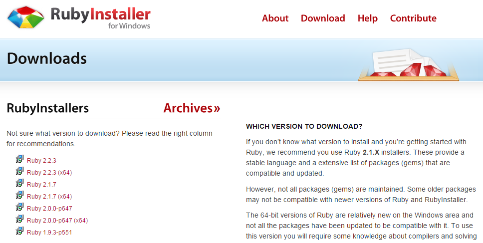
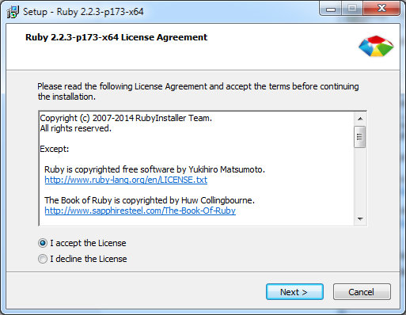
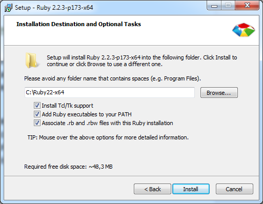
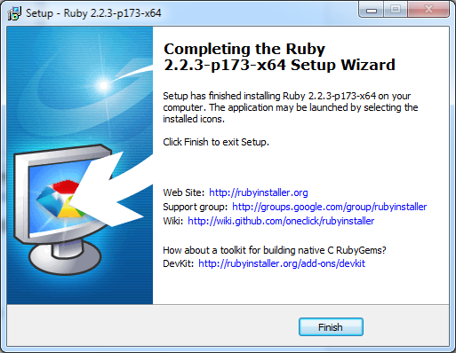
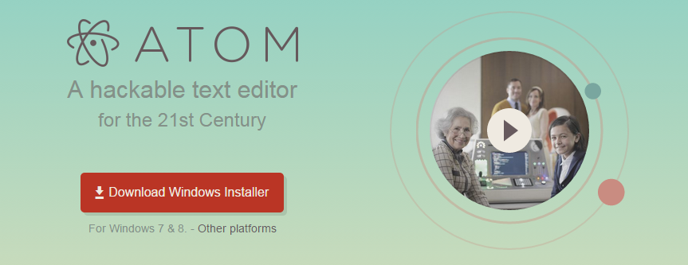

# Aula 01 - Instalação e Configuração do Ambiente de Desenvolvimento {#aula01}

## Introdução {#aula01-introducao}

Seja bem-vindo à nossa jornada! Você está prestes a entrar no mundo da programação através do estudo de duas importantes vertentes: a estruturada e a orientada a objetos. Através desse material, iremos navegar nesse mundo aprendendo conceitos, técnicas e comandos que irão nos permitir construir programas de computador, que são cada vez mais indispensáveis numa sociedade tão dependente da tecnologia.

Nessa aula iremos dar início aos nossos estudos através de uma breve apresentação sobre a linguagem de programação que será utilizada na nossa disciplina, além dos procedimentos de instalação da própria linguagem e de uma ferramenta para programação.

Muitas pessoas não sabem, mas usamos uma linguagem para construir programas de computador, sistemas de software e páginas na internet. Assim como o autor de um livro usa um idioma para escrevê-lo, um programador usa uma linguagem para desenvolver um software. Atualmente, existem várias linguagens disponíveis, cada uma com vantagens e desvantagens. A discussão sobre qual é a "melhor" linguagem de programação é igual a uma discussão sobre qual é o melhor time de futebol: um debate eterno que não vai nos levar a lugar algum. Mais importante do que aprender a programar numa linguagem de programação é compreender os conceitos que são aplicados a todas as linguagens.

Para a nossa aventura, escolhemos a linguagem Ruby. Ruby é uma linguagem fantástica! Criada em 1995, no Japão, por Yukihiro Matsumoto, mais conhecido como Matz. É uma linguagem interpretada, multiparadigma, de tipagem dinâmica e forte (WIKIPÉDIA, 2015). Não entendeu nada, certo? Não se preocupe, pois vamos descobrir e discutir esses conceitos ao longo das nossas aulas. Ruby é uma linguagem bastante semelhante a Python. Portanto, aqueles que já estudaram Python tendem a ter uma certa facilidade no aprendizado de Ruby. A escolha da linguagem Ruby para as nossas aulas deu-se pelo fato de que ela implementa melhor os conceitos do paradigma orientado a objeto, que é um dos temas que será apresentado em breve.

Como você deve estar imaginando, a logo do Ruby é um rubi, que é uma pedra preciosa de cor vermelha, conforme ilustra a [Figura 01](#aula01-figura01). A escolha desse nome foi feita em uma conversa online entre Matz e Keiju Ishitsuka em 24 de fevereiro de 1993. Eles tomaram essa decisão antes de qualquer codificação para se produzir a linguagem, e essa escolha foi feita entre duas opções: Coral ou Ruby (WIKIPÉDIA, 2015).


###### Figura 01 - Logo da linguagem Ruby. Fonte: Ruby, 2015 {#aula01-figura01}

## Instalação do Ruby {#aula01-instalacao-do-ruby}

O primeiro passo para que possamos começar a aprender Ruby é, naturalmente, instalá-lo no nosso sistema operacional. Iremos aprender como instalar o Ruby no Windows e no Linux. Usaremos a versão 2.2.3 do Ruby que, no momento, é a versão mais nova da linguagem.

### Instalação do Ruby no Windows {#aula01-instalacao-do-ruby-no-windows}

Para instalar o Ruby no Windows, usaremos um instalador chamado *[RubyInstaller for Windows](http://rubyinstaller.org/)*.

**Passo 1** - Acesse a página de downloads RubyInstaller através do endereço: <http://rubyinstaller.org/downloads>. Você deve visualizar uma página, conforme ilustra a [Figura 02](#aula01-figura02).


###### Figura 02 - Downloads do RubyInstaller {#aula01-figura02}

**Passo 2** - Se seu computador for x32, faça o download do instalador clicando no link *Ruby 2.2.3*. Se seu computador for x64, faça o download clicando no link *Ruby 2.2.3 (x64)*. Caso não saiba, recomendamos fazer o download do instalador clicando no link *Ruby 2.2.3*.

**Passo 3** - Uma vez concluído o download do instalador, clique duas vezes sobre ele para executá-lo.

**Passo 4** - Na primeira tela do assistente de instalação, ilustrada na [Figura 03](#aula01-figura03), você poderá configurar o idioma durante a instalação. Recomendamos deixar a opção *English* e clique em *OK*.


###### Figura 03 - Configuração do idioma do instalador {#aula01-figura03}

**Passo 5** - Na segunda tela do assistente de instalação, ilustrada na [Figura 04](#aula01-figura04), será solicitado que você aceite os termos da licença. Selecione a opção *I accept the License* e depois clique no botão *Next >*.


###### Figura 04 - Licença de uso {#aula01-figura04}

**Passo 6** - Na terceira tela do assistente de instalação, ilustrada na [Figura 05](#aula01-figura05), você poderá configurar o local de instalação do Ruby. Recomendamos deixar o local de instalação padrão, contudo, selecione as três opções que aparecem: *Install Tcl/Tk support*, *Add Ruby executables to your PATH* e *Associate .rb and .rbw files with this Ruby installation*. A primeira opção instala o suporte para construção de interfaces gráficas; a segunda opção adiciona os executáveis do Ruby ao PATH do Windows, nos permitindo executá-los no prompt de comando; e a terceira opção permite-nos executar os arquivos com extensão .rb e .rbw, clicando duas vezes sobre eles. Por fim, clique no botão *Install*.


###### Figura 05 - Local de instalação e demais configurações {#aula01-figura05}

**Passo 7** - Na última tela do assistente de instalação, ilustrada na [Figura 06](#aula01-figura06), conclua a instalação clicando no botão *Finish*.


###### Figura 06 - Finalizando a instalação {#aula01-figura06}

Parabéns! Você concluiu a instalação do Ruby no Windows!

## Instalação do Ruby no Linux {#aula01-instalacao-do-ruby-no-linux}

Instalaremos o Ruby no Linux usando o RVM (*Ruby Version Manager*), que é um gerenciador de versões do Ruby. O RVM permite-nos ter mais de uma versão do Ruby instalada. Mas antes de instalar o RVM, vamos iniciar instalando algumas dependências.

```
$ sudo apt-get update
$ sudo apt-get install git-core curl zlib1g-dev build-essential libssl-dev libreadline-dev libyaml-dev libsqlite3-dev sqlite3 libxml2-dev libxslt1-dev libcurl4-openssl-dev python-software-properties libffi-dev
```

Uma vez concluída a instalação dessas dependências, podemos dar início à instalação do RVM.

```
$ sudo apt-get install libgdbm-dev libncurses5-dev automake libtool bison libffi-dev
$ curl -L https://get.rvm.io | bash -s stable
```

Após a execução dos comandos acima, use o RVM para instalar a versão 2.2.3 do Ruby usando os comandos abaixo.

```
$ source ~/.rvm/scripts/rvm
$ rvm install 2.2.3
$ rvm use 2.2.3 -default
```

Parabéns! Você acabou de concluir a instalação do Ruby no Linux!

<hr>

#### Atividade 1.1

Agora é a sua vez! Siga os passos descritos nesta aula para instalar o Ruby no seu Windows ou Linux.

<hr>

## Instalação da ferramenta de desenvolvimento {#aula01-instalacao-da-ferramenta-de-desenvolvimento}

Uma ferramenta de desenvolvimento é um programa que usamos para codificar. Como segundo passo para a nossa jornada de aprendizado, precisamos instalar e configurar o Atom (ATOM, 2015), que é uma ferramenta de desenvolvimento muito leve e versátil, pois conta com plug-ins e temas que nos permitem personalizá-la, deixando a ferramenta adaptada às preferências de cada programador. Vamos aprender como instalar o Atom no Windows o no Linux.


###### Figura 07 - Instalar e configurar o Atom. Fonte: (ATOM, 2015) {#aula01-figura07}

### Instalação do Atom no Windows {#aula01-instalacao-do-atom-no-windows}

A instalação do Atom no Windows é bem simples: primeiro faça o download do instalador através do endereço [http://atom.io](http://atom.io). Na página inicial, ilustrada na [Figura 08](#aula01-figura08), clique em *Download Windows Installer* para fazer o download do instalador do Atom para Windows.


###### Figura 08 - Download do Atom para Windows. Fonte: (ATOM, 2015) {#aula01-figura08}

Uma vez concluído o download, execute o instalador e aguarde. Quando a instalação for concluída, o Atom será aberto conforme ilustra a [Figura 09](#aula01-figura09).


###### Figura 09 - Tela inicial do Atom após a conclusão da instalação {#aula01-figura09}

Muito bem! Você acabou de concluir a instalação do Atom no seu Windows. Não iremos criar nem um projeto ou codificar no momento, portanto você pode fechá-lo.

### Instalação do Atom no Linux {#aula01-instalacao-do-atom-no-linux}

Para instalar o Atom no Linux, faça o download do pacote Debian (<https://atom.io/download/deb>) ou RPM (<https://atom.io/download/rpm>), e faça a instalação do pacote usando o comando apropriado.

Para instalar o Atom usando o pacote Debian, use o comando abaixo.

```
$ sudo dpkg -i atom-amd64.deb
```

Para instalar o Atom usando o pacote RPM, use o comando abaixo.

```
$ rpm -i atom.x86_64.rpm
```

Ótimo! Você concluiu a instalação do Atom no Linux!

<hr>

#### Atividade 1.2

Agora que você viu como fazer a instalação do Atom no Windows e no Linux, proceda com a instalação do Atom no seu sistema operacional.

<hr>

## Referências

ATOM. Atom. Atom, 2015. Disponivel em: <http://atom.io>. Acesso em: 14 set. 2015.

INSTALLER, R. Ruby Installer for Windows. Ruby Installer for Windows, 2015. Disponivel em: <http://rubyinstaller.org/>. Acesso em: 23 out. 2015.

RUBY. The Ruby Logo. Ruby Language, 2015. Disponivel em: <https://www.ruby-lang.org/en/about/logo/>. Acesso em: 21 out. 2015.
WIKIPÉDIA. Ruby. Wikipédia, 2015. Disponivel em: <https://pt.wikipedia.org/wiki/Ruby_(linguagem_de_programa%C3%A7%C3%A3o)>. Acesso em: 21 out. 2015.

WIKIPÉDIA. Yukihiro Matsumoto. Wikipédia, 2015. Disponivel em: <https://pt.wikipedia.org/wiki/Yukihiro_Matsumoto>. Acesso em: 21 out. 2015.
